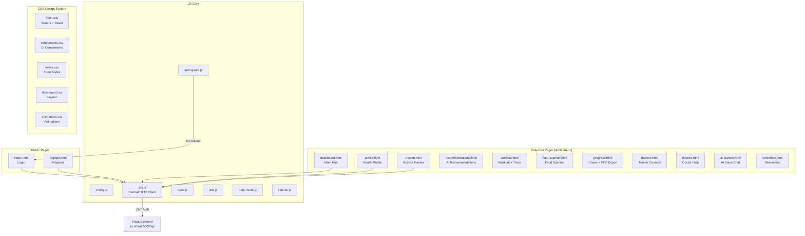

# 🏋️ FitLife Frontend — Project Status Report

> **Project:** AI-Based Healthy Diet & Fitness Management System (Frontend)  
> **Tech Stack:** Vanilla HTML5 + CSS3 + JavaScript (ES6+) — No build tools  
> **Backend:** Flask API at `http://localhost:5000/api`  
> **Auth:** JWT stored in `localStorage`  
> **Report Date:** March 31, 2026

---

## 📊 Overall Progress Summary

| Phase | Status | Progress |
|---|---|---|
| **Phase 1:** Foundation (CSS + JS Core + Auth) | ✅ Complete | 100% |
| **Phase 2:** Dashboard + Profile | ✅ Complete | 100% |
| **Phase 3:** Core Features (Tracker, Recommendations, Workout, Food Scanner) | ✅ Complete | 100% |
| **Phase 4:** Progress + PDF Export | ⚠️ Partial | ~70% |
| **Phase 5:** Advanced Features (AI Planner, Trainers, Doctors, Reminders) | ✅ Complete | 100% |
| **Phase 6:** Polish & Optimization | ❌ Not Started | 0% |

> [!IMPORTANT]
> **All 13 HTML pages and 19 JavaScript modules have been created.** The codebase is structurally complete but needs `pdf-export.js`, integration testing with the live backend, and Phase 6 polish work.

---

## ✅ What Has Been Done

### Phase 1: Foundation — ✅ COMPLETE

The entire design system and core infrastructure was built from scratch:

#### CSS Architecture (8 files)

| File | Size | What It Does |
|---|---|---|
| [main.css](file:///c:/Users/rajus/fitlife/frontend/css/main.css) | 6.5 KB | Google Fonts (Sora + DM Mono), CSS custom properties for light/dark themes, global reset, typography, link styles, layout containers |
| [auth.css](file:///c:/Users/rajus/fitlife/frontend/css/auth.css) | 3.9 KB | Centered card login & register layouts, decorative gradient orbs, password strength bar |
| [dashboard.css](file:///c:/Users/rajus/fitlife/frontend/css/dashboard.css) | 6.4 KB | Fixed sidebar, `.main-wrap`, `.topbar`, `.page-content`, responsive breakpoints (mobile drawer at ≤768px) |
| [components.css](file:///c:/Users/rajus/fitlife/frontend/css/components.css) | 19.2 KB | `.card`, `.btn` variants, `.badge`, `.progress-wrap`, `.toast`, `.skeleton`, `.empty-state`, `.modal`, stat cards, tab bars, glass effects |
| [forms.css](file:///c:/Users/rajus/fitlife/frontend/css/forms.css) | 10.6 KB | Input groups, select dropdowns, radio/checkbox card styles, range sliders, step-form navigation |
| [charts.css](file:///c:/Users/rajus/fitlife/frontend/css/charts.css) | 2.9 KB | Chart.js canvas wrapper, responsive chart containers |
| [dark-mode.css](file:///c:/Users/rajus/fitlife/frontend/css/dark-mode.css) | 2.7 KB | `[data-theme="dark"]` overrides for all components |
| [animations.css](file:///c:/Users/rajus/fitlife/frontend/css/animations.css) | 5.5 KB | `@keyframes shimmer`, `fadeIn`, `slideUp`, `pulse`, `.spinner`, transition utility classes, staggered animation delays |

#### JS Core Modules (6 files)

| File | Size | What It Does |
|---|---|---|
| [config.js](file:///c:/Users/rajus/fitlife/frontend/js/config.js) | 1.5 KB | `CONFIG` object: `API_BASE`, `TOKEN_KEY` (`access_token`), `USER_KEY` (`user`), `THEME_KEY`, water/sleep goals, chart colors, backend-matching enums |
| [api.js](file:///c:/Users/rajus/fitlife/frontend/js/api.js) | 5.2 KB | Central `apiFetch()` wrapper — auto-attaches JWT, handles 401 with targeted `removeItem()`, grouped exports: `authAPI`, `profileAPI`, `dashboardAPI`, `recommendAPI`, `activityAPI`, `foodAPI`, `workoutAPI`, `trainerAPI`, `doctorAPI`, `aiAPI`, `reminderAPI`, `progressAPI`, `exportAPI` |
| [auth-guard.js](file:///c:/Users/rajus/fitlife/frontend/js/auth-guard.js) | 540 B | IIFE that checks `localStorage` for token, redirects to login if missing |
| [toast.js](file:///c:/Users/rajus/fitlife/frontend/js/toast.js) | 1.3 KB | `showToast(message, type, duration)` — success/error/warning/info with auto-dismiss |
| [utils.js](file:///c:/Users/rajus/fitlife/frontend/js/utils.js) | 5.3 KB | `isValidEmail()`, `todayDate()`, `formatDate()`, `getBMICategory()`, `getPasswordStrength()`, and more helper functions |
| [dark-mode.js](file:///c:/Users/rajus/fitlife/frontend/js/dark-mode.js) | 2.0 KB | Theme toggle logic, persists to `localStorage`, applies `data-theme` attribute on `<html>` |

#### Auth Pages (2 HTML + 1 JS)

| File | Size | What It Does |
|---|---|---|
| [index.html](file:///c:/Users/rajus/fitlife/frontend/index.html) | 4.8 KB | Login page — email + password form, remember me checkbox, password visibility toggle, decorative gradient orbs, dark mode toggle, link to register |
| [register.html](file:///c:/Users/rajus/fitlife/frontend/register.html) | 6.9 KB | Sign up — full name, email, password with real-time strength bar, confirm password matching |
| [auth.js](file:///c:/Users/rajus/fitlife/frontend/js/auth.js) | 6.9 KB | Login handler → `POST /api/login` → store token + user → redirect. Register handler → `POST /api/register` → redirect to login with success toast. Client-side validation (email format, password strength, confirm match) |

---

### Phase 2: Dashboard + Profile — ✅ COMPLETE

| File | Size | What It Does |
|---|---|---|
| [dashboard.html](file:///c:/Users/rajus/fitlife/frontend/dashboard.html) | 12.2 KB | Full sidebar navigation (all 11 protected pages + logout), topbar with greeting + dark mode toggle, card grid: BMI, Calorie Ring (doughnut), Workout Streak, Water Progress, Weekly Calorie Chart (Chart.js bar), motivational quote, weekly tip, quick log buttons |
| [dashboard.js](file:///c:/Users/rajus/fitlife/frontend/js/dashboard.js) | 7.7 KB | `loadDashboard()` → `GET /api/dashboard`, renders BMI card, calorie ring (Chart.js doughnut), streak, water bar, weekly chart, quote. Quick log button handlers |
| [profile.html](file:///c:/Users/rajus/fitlife/frontend/profile.html) | 19.0 KB | 3-step form: Personal Info → Body & Lifestyle → Goal. Live BMI calculator, icon-based radio cards for gender/activity/food habits/goal, step navigation |
| [profile.js](file:///c:/Users/rajus/fitlife/frontend/js/profile.js) | 9.5 KB | Step navigation logic, live BMI calculation, `GET /api/profile` to pre-fill, `POST /api/profile` to create/update, success toast with BMI/BMR/calories |
| [sidebar.js](file:///c:/Users/rajus/fitlife/frontend/js/sidebar.js) | 1.9 KB | Shared sidebar behavior — mobile hamburger toggle, user info population from localStorage, logout handler |

---

### Phase 3: Core Features — ✅ COMPLETE

| File | Size | What It Does |
|---|---|---|
| [tracker.html](file:///c:/Users/rajus/fitlife/frontend/tracker.html) | 17.6 KB | Date picker with prev/next day buttons, tab bar (Meals / Workout / Water / Sleep), daily summary cards (calories in/out, water, sleep), meal log form, workout log form, water quick-add buttons with progress bar, sleep slider |
| [tracker.js](file:///c:/Users/rajus/fitlife/frontend/js/tracker.js) | 12.2 KB | Tab switching, `POST /api/activity` for each log type (meal/workout/water/sleep), `GET /api/activity?date=` to load day's logs, daily summary calculation, date navigation |
| [recommendations.html](file:///c:/Users/rajus/fitlife/frontend/recommendations.html) | 10.1 KB | BMI category gradient banner, calorie target badge, diet plan card, workout plan card (Mon-Sun grid), weekly tips section, refresh button, generated_at timestamp |
| [recommendations.js](file:///c:/Users/rajus/fitlife/frontend/js/recommendations.js) | 8.6 KB | `GET /api/recommendations` → render diet cards (handles structured `{ meal, kcal }` format), workout grid (handles structured exercise objects), tips list |
| [workout.html](file:///c:/Users/rajus/fitlife/frontend/workout.html) | 9.4 KB | Session progress bar, timer card (start/pause/reset/done), exercise cards container, "Finish Workout" button |
| [workout.js](file:///c:/Users/rajus/fitlife/frontend/js/workout.js) | 9.8 KB | `GET /api/workout/plan` → render today's exercises, `WorkoutTimer` class (countdown with alarm), `POST /api/workout/timer` on exercise completion, browser notification + SpeechSynthesis alarm |
| [food-scanner.html](file:///c:/Users/rajus/fitlife/frontend/food-scanner.html) | 11.0 KB | Search tabs (text search / barcode scan), search input with icon, barcode input field, search results list, food detail card with nutrition grid, "Add to Today's Log" button |
| [food-scanner.js](file:///c:/Users/rajus/fitlife/frontend/js/food-scanner.js) | 7.9 KB | `GET /api/food/search?q=` → render search results with debounce, `POST /api/food/scan` → render food detail, "Add to log" → `POST /api/activity` with `log_type: "meal"` |

---

### Phase 4: Progress — ⚠️ PARTIAL (Progress page done, PDF Export missing)

| File | Size | Status | What It Does |
|---|---|---|---|
| [progress.html](file:///c:/Users/rajus/fitlife/frontend/progress.html) | 10.9 KB | ✅ Done | Period toggle (Weekly/Monthly), weight trend line chart, calorie tracking bar chart, workout frequency doughnut chart, BMI trend display, Export PDF button |
| [progress.js](file:///c:/Users/rajus/fitlife/frontend/js/progress.js) | 10.4 KB | ✅ Done | `GET /api/progress?period=weekly|monthly` → render Chart.js charts (line, bar, doughnut). Period switching |
| `pdf-export.js` | — | ❌ **Missing** | Not yet created. Should implement client-side PDF generation with jsPDF + html2canvas, OR use `GET /api/export/pdf` to download backend-generated PDF |

---

### Phase 5: Advanced Features — ✅ COMPLETE

| File | Size | What It Does |
|---|---|---|
| [trainers.html](file:///c:/Users/rajus/fitlife/frontend/trainers.html) | 8.7 KB | Location search input, trainer cards layout, email/call action buttons |
| [trainers.js](file:///c:/Users/rajus/fitlife/frontend/js/trainers.js) | 4.5 KB | `GET /api/trainers?location=` → render trainer cards with rating, specialization, availability, contact info |
| [doctors.html](file:///c:/Users/rajus/fitlife/frontend/doctors.html) | 8.0 KB | Specialization filter, doctor cards with hospital, available slots, rating |
| [doctors.js](file:///c:/Users/rajus/fitlife/frontend/js/doctors.js) | 3.9 KB | `GET /api/doctors?specialization=` → render doctor cards with contact/book slot buttons |
| [ai-planner.html](file:///c:/Users/rajus/fitlife/frontend/ai-planner.html) | 9.7 KB | Chat interface with message bubbles, text input + microphone button + send button, voice output toggle, typing indicator |
| [ai-planner.js](file:///c:/Users/rajus/fitlife/frontend/js/ai-planner.js) | 6.9 KB | `POST /api/ai/diet-chat` with `{ message, voice_input }`, Web Speech API (SpeechRecognition for voice input, SpeechSynthesis for voice output), chat history in memory |
| [reminders.html](file:///c:/Users/rajus/fitlife/frontend/reminders.html) | 10.2 KB | Add reminder form (type, message, time, repeat toggle), active reminders list |
| [reminders.js](file:///c:/Users/rajus/fitlife/frontend/js/reminders.js) | 7.3 KB | `GET /api/reminders` → render list, `POST /api/reminders` → create, `DELETE /api/reminders/:id` → remove, client-side polling for browser notifications, `Notification.requestPermission()` |

---

## ❌ What Needs to Be Done

### 1. `pdf-export.js` — Phase 4 Completion 🔴 Priority: HIGH

**Status:** Not created yet  
**Estimated effort:** Small (1 file)

**Two options:**
- **Option A (Client-side):** Use jsPDF + html2canvas CDN libraries to capture the progress page DOM and export as PDF
- **Option B (Backend download):** Use `GET /api/export/pdf` → download blob as PDF file

**Implementation:**
```
- Add jsPDF (2.5.1) and html2canvas (1.4.1) CDN links to progress.html
- Create js/pdf-export.js:
  - Capture the progress charts and stats via html2canvas
  - Generate a branded PDF with jsPDF
  - Include user name, date, BMI, calorie stats, weight trend, workout summary
  - Trigger download as "health-report.pdf"
- Wire up the "Export PDF" button on progress.html
```

---

### 2. Phase 6: Polish & Optimization 🟡 Priority: MEDIUM

These are UX enhancements that elevate the app from functional to professional:

#### 2a. Skeleton Loaders
- Add shimmer/skeleton loading states on all data-fetching pages
- Replace current "Loading..." text with animated skeleton cards
- **Pages affected:** Dashboard, Profile, Tracker, Recommendations, Workout, Food Scanner, Progress, Trainers, Doctors, AI Planner, Reminders

#### 2b. Empty State Illustrations
- Many pages already have basic empty states (emoji + text)
- Enhance with better illustrations or SVG graphics for no-data scenarios
- Add call-to-action buttons in empty states (e.g., "Create your profile first" on dashboard)

#### 2c. Micro-Animations
- Add card fade-in on scroll (IntersectionObserver)
- Button hover/active press effects
- Page transition animations
- Smooth number counters on dashboard stats
- Loading spinners on form submit buttons

#### 2d. SEO Meta Tags
- Most pages already have `<title>` and `<meta description>` ✅
- Need to verify all 13 pages have proper meta tags
- Add Open Graph tags for social sharing
- Ensure proper heading hierarchy (`<h1>` per page)

#### 2e. Accessibility
- ARIA labels on interactive elements (partially done ✅)
- Keyboard navigation for tabs and forms
- Focus ring styles
- Screen reader text for icon-only buttons
- Color contrast verification

#### 2f. Performance Optimization
- Lazy-load Chart.js only on pages that use it (dashboard, progress)
- Debounce search inputs (food scanner already has this ✅)
- Minimize redundant API calls
- Add request caching for infrequently changing data (trainers, doctors)

#### 2g. Cross-Browser Testing
- Test on Chrome, Firefox, Edge, Safari
- Verify responsive design at 1024px, 768px, and 480px breakpoints
- Test dark mode across all browsers
- Verify Web Speech API (AI Planner) works in Chrome

---

### 3. Integration Testing with Live Backend 🟡 Priority: MEDIUM

The frontend has been built against the API contract. It needs end-to-end testing with the actual Flask backend:

| Test Area | What to Verify |
|---|---|
| **Auth Flow** | Register → Login → Token storage → Auth guard redirect |
| **Profile CRUD** | Create profile → Pre-fill on revisit → Update → BMI/BMR recalculation |
| **Dashboard** | All stats render correctly from API data, Chart.js renders |
| **Activity Tracker** | Log meal/workout/water/sleep → Verify appears in daily logs |
| **Recommendations** | API returns structured `{ meal, kcal }` diet plan + exercise objects |
| **Workout Timer** | Timer logs to `POST /api/workout/timer`, exercises load from API |
| **Food Scanner** | Search returns results, barcode lookup works, add-to-log creates activity |
| **Progress Charts** | Weekly/monthly period switching, Chart.js renders real data |
| **AI Planner** | Chat messages send/receive, voice input/output works |
| **Trainers/Doctors** | Location/specialization filters work, data renders |
| **Reminders** | CRUD operations work, browser notifications fire |
| **PDF Export** | Download generates valid PDF |

---

### 4. Known Issues & Bugs to Investigate 🟢 Priority: LOW

| # | Issue | Details |
|---|---|---|
| 1 | **`recommendations.html` loads `dashboard.js`** | Line 139 of `recommendations.html` includes `dashboard.js` — this may be intentional (for sidebar) but could cause unwanted `loadDashboard()` execution |
| 2 | **`food-scanner.html` loads `dashboard.js`** | Line 157 of `food-scanner.html` includes `dashboard.js` — same potential issue |
| 3 | **No `assets/` directory** | The plan includes `assets/icons/`, `assets/images/`, and `assets/audio/beep.mp3` — none of these directories/files exist yet |
| 4 | **No service worker** | No offline support or PWA capabilities |
| 5 | **CORS configuration** | The API contract says CORS allows `http://localhost:3000`, but the frontend may be served from different ports depending on the dev server |

---

## 📁 Complete File Inventory

### HTML Pages (13 files)

| # | File | Size | Type | Status |
|---|---|---|---|---|
| 1 | `index.html` | 4.8 KB | Public (Login) | ✅ |
| 2 | `register.html` | 6.9 KB | Public (Register) | ✅ |
| 3 | `dashboard.html` | 12.2 KB | Protected | ✅ |
| 4 | `profile.html` | 19.0 KB | Protected | ✅ |
| 5 | `tracker.html` | 17.6 KB | Protected | ✅ |
| 6 | `recommendations.html` | 10.1 KB | Protected | ✅ |
| 7 | `workout.html` | 9.4 KB | Protected | ✅ |
| 8 | `food-scanner.html` | 11.0 KB | Protected | ✅ |
| 9 | `progress.html` | 10.9 KB | Protected | ✅ |
| 10 | `trainers.html` | 8.7 KB | Protected | ✅ |
| 11 | `doctors.html` | 8.0 KB | Protected | ✅ |
| 12 | `ai-planner.html` | 9.7 KB | Protected | ✅ |
| 13 | `reminders.html` | 10.2 KB | Protected | ✅ |

### CSS Files (8 files)

| # | File | Size | Status |
|---|---|---|---|
| 1 | `main.css` | 6.5 KB | ✅ |
| 2 | `auth.css` | 3.9 KB | ✅ |
| 3 | `dashboard.css` | 6.4 KB | ✅ |
| 4 | `components.css` | 19.2 KB | ✅ |
| 5 | `forms.css` | 10.6 KB | ✅ |
| 6 | `charts.css` | 2.9 KB | ✅ |
| 7 | `dark-mode.css` | 2.7 KB | ✅ |
| 8 | `animations.css` | 5.5 KB | ✅ |

### JavaScript Files (19 files — 18 planned + 1 extra `sidebar.js`)

| # | File | Size | Status |
|---|---|---|---|
| 1 | `config.js` | 1.5 KB | ✅ |
| 2 | `api.js` | 5.2 KB | ✅ |
| 3 | `auth-guard.js` | 540 B | ✅ |
| 4 | `auth.js` | 6.9 KB | ✅ |
| 5 | `toast.js` | 1.3 KB | ✅ |
| 6 | `utils.js` | 5.3 KB | ✅ |
| 7 | `dark-mode.js` | 2.0 KB | ✅ |
| 8 | `sidebar.js` | 1.9 KB | ✅ (bonus — shared sidebar logic) |
| 9 | `dashboard.js` | 7.7 KB | ✅ |
| 10 | `profile.js` | 9.5 KB | ✅ |
| 11 | `tracker.js` | 12.2 KB | ✅ |
| 12 | `recommendations.js` | 8.6 KB | ✅ |
| 13 | `workout.js` | 9.8 KB | ✅ |
| 14 | `food-scanner.js` | 7.9 KB | ✅ |
| 15 | `progress.js` | 10.4 KB | ✅ |
| 16 | `trainers.js` | 4.5 KB | ✅ |
| 17 | `doctors.js` | 3.9 KB | ✅ |
| 18 | `ai-planner.js` | 6.9 KB | ✅ |
| 19 | `reminders.js` | 7.3 KB | ✅ |
| 20 | `pdf-export.js` | — | ❌ Missing |

### Documentation Files

| File | Size | Purpose |
|---|---|---|
| `FRONTEND_PLAN.md` | 46.9 KB | Full frontend architecture plan |
| `frontend_api_contract.md` | 20.9 KB | Backend API contract (source of truth) |
| `AI_FitnessApp_Blueprint.md` | 38.3 KB | Full project blueprint |

---

## 🔧 API Contract Alignment — Resolved Decisions

All major API discrepancies were resolved during the planning phase:

| # | Issue | Resolution |
|---|---|---|
| 1 | Token key naming | ✅ Using `access_token` / `user` (API Contract standard) |
| 2 | Diet plan format | ✅ Using structured `{ meal, kcal }` objects |
| 3 | Workout plan format | ✅ Using structured `{ name, sets, reps, duration_min }` objects |
| 4 | `fiber_g` field | ✅ Display if present, don't crash if missing |
| 5 | 401 cleanup | ✅ Using targeted `removeItem()` to preserve theme preference |
| 6 | Login extra fields (`role`, `created_at`) | ✅ Handled gracefully if missing |
| 7 | Response message text differences | ✅ Frontend uses own toast messages |

---

## 🚀 Recommended Next Steps (Priority Order)

1. **Create `pdf-export.js`** — Complete Phase 4 (estimated: 30 min)
2. **Start Flask backend** and run end-to-end integration tests
3. **Fix potential bugs** (`dashboard.js` loaded unnecessarily on some pages)
4. **Create `assets/` directory** with placeholder icons, images, and `beep.mp3` audio
5. **Add skeleton loaders** to data-fetching pages
6. **Enhance empty states** with better visuals and CTAs
7. **Add micro-animations** (scroll-triggered fade-ins, stat counters)
8. **Cross-browser testing** at all breakpoints
9. **Accessibility audit** (ARIA, keyboard nav, contrast)
10. **Consider PWA conversion** (service worker, manifest.json) — optional stretch goal

---

## 📐 Architecture Diagram



---

> **Total codebase size:** ~280 KB of frontend code (13 HTML + 19 JS + 8 CSS)  
> **Total files:** 40+ files (including documentation)  
> **Completion:** ~90% of functional implementation done
